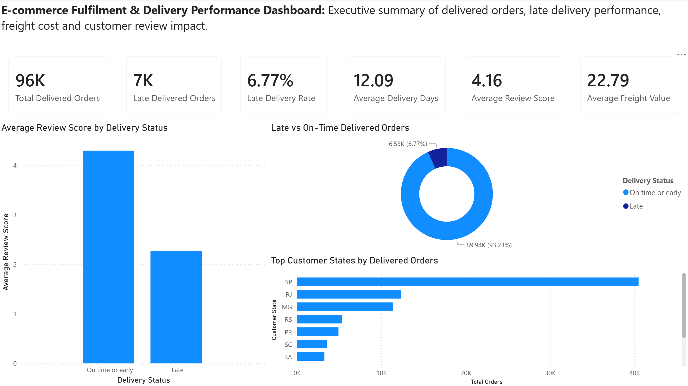
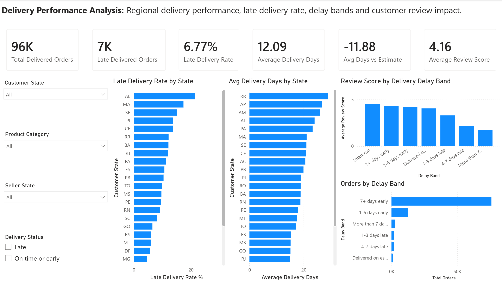
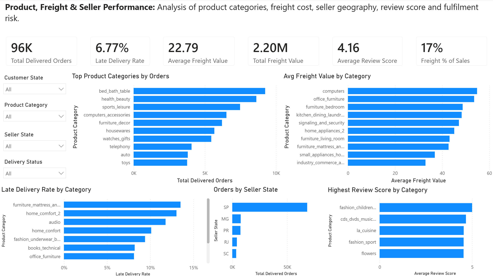

# E-commerce Fulfilment & Delivery Performance Analysis

## Dashboard Preview

The Power BI dashboard contains three report pages:

1. Executive Summary
2. Delivery Performance
3. Product, Freight & Seller Performance

### Executive Summary

This page provides a high-level overview of delivered orders, late delivery rate, average delivery days, review score, freight value and customer state order volume.

---

### Delivery Performance

This page focuses on regional delivery performance, late delivery rate, average delivery days, delay bands and the relationship between delivery performance and customer review score.

---

### Product, Freight & Seller Performance

This page analyses product category order volume, freight cost, late delivery rate by product category, seller state concentration and review score by category.

---

## Project Summary

This project is an end-to-end data analysis portfolio project focused on e-commerce fulfilment, delivery performance, freight cost, customer satisfaction and late delivery risk.

The project uses the Olist Brazilian E-Commerce Public Dataset and demonstrates Python, SQL, SQLite, Power BI, GitHub documentation and business analysis skills.

## Tools Used

- Python
- pandas
- SQL / SQLite
- Power BI
- Git and GitHub
- VS Code
- Jupyter Notebook

## Project Pipeline

Raw CSV files → Python cleaning → Processed datasets → SQLite database → SQL views → Power BI dashboard

---

## Key Outputs

This project includes the following completed outputs:

- Data understanding notebook
- Data cleaning and preparation notebook
- Exploratory data analysis notebook
- Cleaned processed datasets
- Analysis-ready master dataset
- SQLite database
- SQL data quality checks
- SQL analysis queries
- SQL views for Power BI
- Power BI dashboard file
- Dashboard screenshots
- Executive summary report
- Methodology report
- Business recommendations report

---

## Reports

The project includes three written report files:

| Report                                                          | Purpose                                                                                           |
| --------------------------------------------------------------- | ------------------------------------------------------------------------------------------------- |
| [Executive Summary](reports/executive_summary.md)               | Summarises the project purpose, dashboard KPIs, key findings, limitations and future improvements |
| [Methodology](reports/methodology.md)                           | Explains the end-to-end project approach, tools, data preparation and analysis process            |
| [Business Recommendations](reports/business_recommendations.md) | Converts the analysis into practical actions for an e-commerce fulfilment or operations team      |

---

## Current Project Status

**Current stage:** Power BI dashboard created and documented.

**Next stage:** Final portfolio polish, CV project write-up and interview story.
